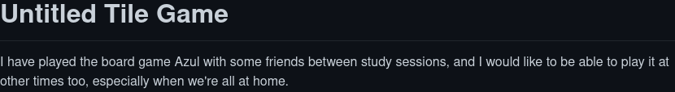

# Meme Game



My buddy Mads has a lovely server which automatically generates classic Image Macro memes with a picture, a top text, and a bottom text, all based on user submissions.
This project is a game which uses his meme generator API to make a "put the best caption on the picture" type game.

## TODO

- [ ] Both configs for meme layout (stretch vs retain aspect)
  - [x] Retain Aspect
  - [ ] Stretchyyyyyy
- [ ] UI for pick-a-card
  - [ ] Desktop
  - [ ] Mobile
- [ ] UI for going through submissions
  - [ ] Spectator/hub view
  - [ ] Tzar view
  - [ ] Others?
- [ ] Logic for Tzar
- [ ] Score system
- [ ] End-of-game highlights

- [ ] Head-to-head mode (All do prompts, but each round is Quiplash-esque 1v1 all-vote)

## Development

In one shell, open this repository, navigate to `server/` and run `yarn dev`:

```sh
cd server
yarn dev
```

In another shell, navigate to `client` and run `yarn dev` there:

```sh
cd client
yarn dev
```

Deployment involves building each project via their respective `yarn build` commands

